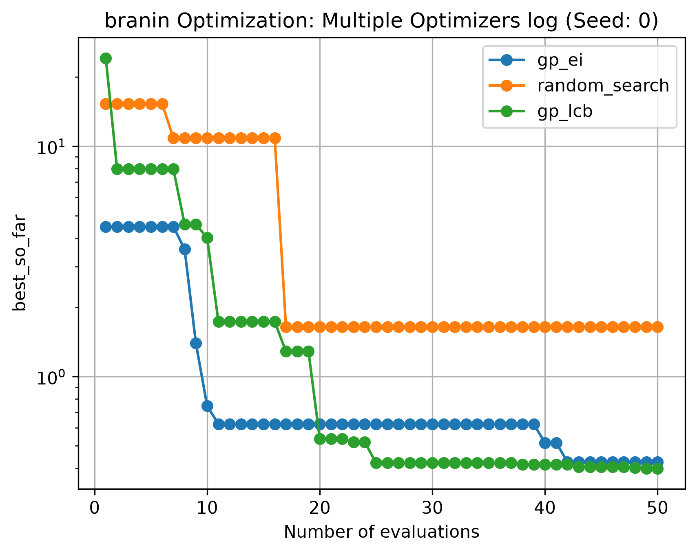

# BayesBench

BayesBench is a reproducible benchmark framework for **Bayesian Optimization** and **sample-efficient black-box optimization**.

The goal of this project is to study how different optimization methods, such as **Gaussian Process Bayesian Optimization with Expected Improvement (GP-EI)** or **Upper Confidence Bound (UCB)**, perform on standard benchmark functions under a limited evaluation budget compared to **Random Search**.

## Current Status

BayesBench is an **in-progress** project.  
The first benchmark pipeline is implemented for the **Branin function** and **Ackley function**, including:

- a synthetic optimization benchmark,
- a random search baseline,
- a Gaussian Process surrogate model,
- an Expected Improvement acquisition function,
- an experiment runner,
- and visualization tools for comparing methods.



## Why this project?

Bayesian Optimization is useful when objective evaluations are expensive.  
Instead of evaluating many random candidates, it uses a probabilistic surrogate model to decide which point to evaluate next.

BayesBench is designed to make it easy to compare optimization methods in a consistent, reproducible way.


## Repository structure

```text
BayesBench/
├── README.md
├── pyproject.toml
├── src/
│   └── bayesbench/
│       ├── benchmarks/
│       ├── acquisition/
│       ├── optimizers/
│       ├── experiments/
│       └── visualization/
├── results/
└── tests/
```

## Installation

Clone the repository and install the package. I recommend conda environment

```bash
git clone https://github.com/shosakaue0808/BayesBench.git
cd BayesBench
conda create -n bayesbench python=3.11
conda activate bayesbench
pip install -e .
```
